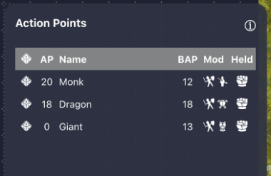

# Chivalry & Sorcery 5th Edition Action Points Tracker

Running C&S combat and keeping track of the number of Action Points each character has, and their resulting initiative order, can be tricky. This simple AP tracker for Owlbear Rodeo 2 automates much of that process and allows GM's & Players to easily manage their character's AP.

The extension can be added by following the instructions in the [Owlbear Rodeo Guide](https://extensions.owlbear.rodeo/guide).

## Using the Tracker

Characters can be added to the tracker using the context menu for their map icon. Click the  icon and enter the characters Base Action Points (BAP). Multiple characters can be added by selecting them as a group and then clicking the tracker icon, the same BAP will be applied to all of them. Multi-select can also be used to set an armour type (see below).

The popover is opened using the same  icon on the Owlbear Rodeo menu at top left.

The AP table shows a character's current Action Points, their name & Base Action Points, AP Modifiers for status & armour, and whether they have held any AP over to the next round.

Players can roll 1D10 for their AP at the start of a round using the  icon next to their character, as can the GM for NPC's. The GM also has an icon in the table header which can be used to roll for all characters at once.

The list will automatically sort on the highest available AP from top to bottom. Characters with AP held to the next round will show 0 available AP and a number in the Held column.

For instructions during play, hover your cursor over the  icon.

Players and the GM can spend AP by hovering the cursor over their character's current AP value and selecting the number of AP they want to spend in an action phase - up to their available AP or 10. AP totals and table order will be adjusted automatically.

## AP Modifiers

The character's armour AP modifier _(Core Rulebook, pp 268)_ is applied by using the character icon's context menu to select an armour type (none, light, heavy, battle).

Character status AP Modifiers _(Core Rulebook, pp 268)_ are applied using Owlbear Rodeo status ring attachments, just drag the relevant attachment onto a character to trigger an appropriate modifier. Delete the attachment to remove the modifier. Note: you will need the Owlbear Rodeo **Status Rings** starter set installed.

- **Exhausted** applies a -10 AP penalty for being fatigued
- **Incapacitated** drops AP to 0
- **Dead** drops AP to 0

Both of these modifiers show as icons in the **Mod** column on the tracker, details can be checked by placing the mouse cursor over the icons.
